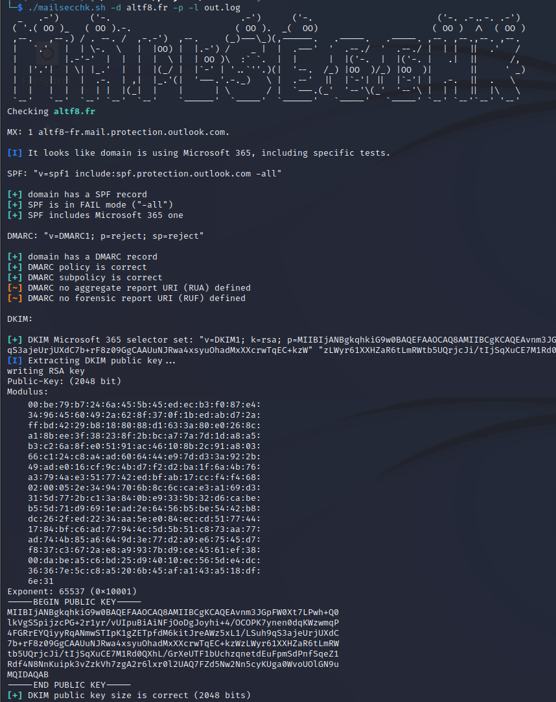

# mailsecchk

A simple shell script (almost) POSIX(1) for mail security checks against domain names.

```
Usage: ./mailsecchk.sh [OPTIONS]...
check mail security of a given domain

arguments:
  -d domain to be checked
  -h display this help and exit
  -l log file to output to
  -p extract DKIM public key if found
  -r SPF recursive tests
```

(1): not POSIX anymore as keyword "local" is used, but it should work on most UNIX.

## Current checks

* SPF DNS record presence
* SPF not using FAIL mode "-all"
* SPF include not resolving to a correct DNS TXT record (potential domain takeover)
* DMARC DNS record presence
* DMARC policy ("p")
* DMARC subpolicy ("sp")
* DMARC sample percentage ("pct")
* DMARC aggregation and forensic reports send to third-parties ("rua" and "ruf")
* DKIM dictionnary guess for selectors (list is in dkim_selectors.txt)
* DKIM public key size (if public key extraction is enabled)

Checks for specific mail providers:

* SPF set to include mail provider SPF
* DKIM presence (selectors are often predictable)

Currently included providers:

* Microsoft 365
* Google workspace

Other features

* DKIM public key extraction if selector is found
* Recursive checks on SPF includes

Note: if recursion on SPF includes is not enabled, you may end up with false positives on wether a mail provider SPF is included for a domain or not.

## Examples




